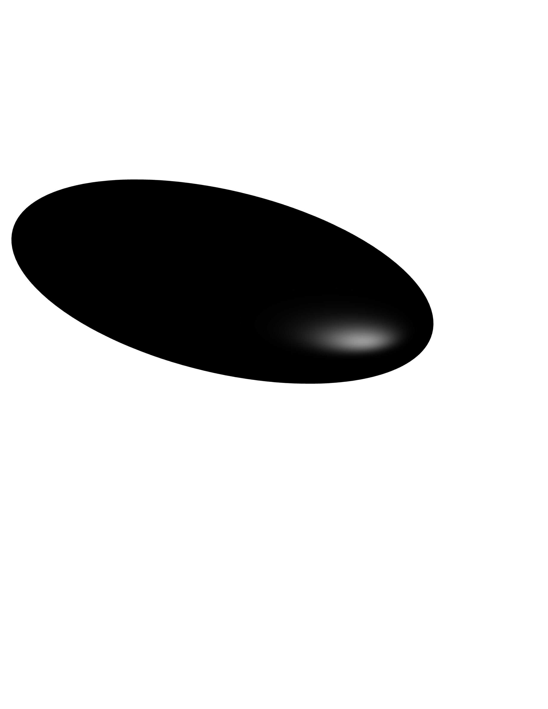
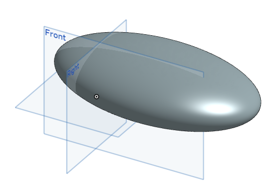
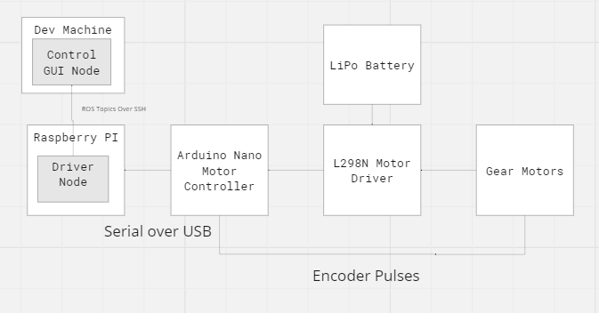
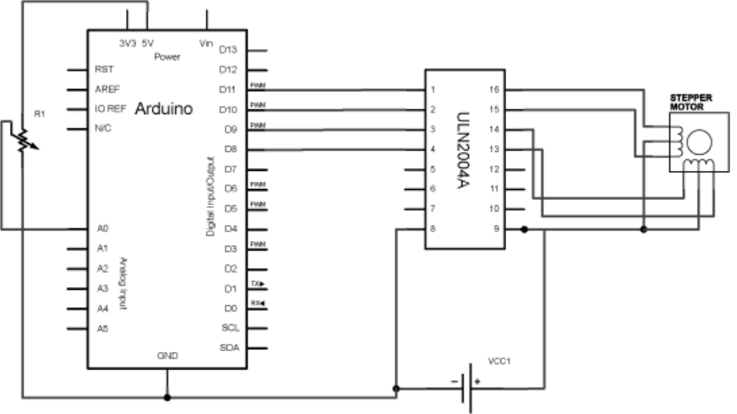
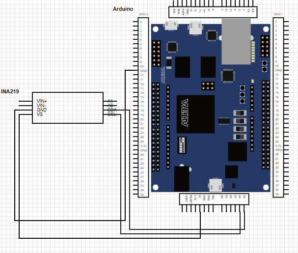
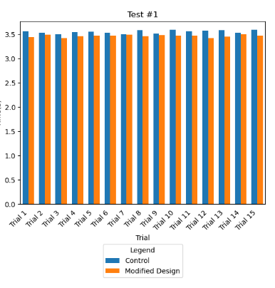
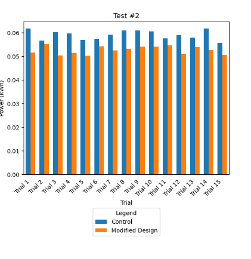

# Undulatory Swimming: A Topological and Computational Model

## Authors

- Dobromir Iliev @dobromiriiliev
- Ricardo Guardado @RicardoG2005
- Anish Goyal @anishgoyal1108

## Overview

Traditional submersibles lack the integration of neurological control mechanisms. The challenge was to design a more efficient system that mimics the streamlined locomotion of aquatic species for energy-efficient propulsion. We analyzed Zebrafish neurology and fluid dynamics to design a submersible with an optimized hull and highly-efficient biomimetic propulsion system.

## Background

We focused on undulatory swimming, commonly observed in aquatic organisms, such as fish. Our case study revolves around Zebrafish, whose spinal circuits provide key insights into natural propulsion systems. Zebrafish were chosen due to their simple neurology and rhythmic swimming patterns that can occur without sensory input. Understanding this allowed us to develop a biomimetic propulsion system.

## Architecture

The optimized submersible has two components: the topological and neurological model.

### Topological Model

We designed the topological model using principles of **computational fluid dynamics**. The 3D model was initialized by solving the **Navier-Stokes equations**, which represent fluid flow across the x, y, and z dimensions.

We employed a **bounce-back scheme** to simulate fluid-solid interactions, particularly important when fluid encounters boundaries. Additionally, turbulence was modeled using the **Smagorinsky-Lilly** model, adding stochastic fluctuations to capture more realistic behaviors in turbulent fluid environments.

The design incorporated a **priority queue system** to optimize computational efficiency, prioritizing grid points with greater complexity. This allows the model to simulate complex fluid flow interactions while maintaining high efficiency. We utilized MATLAB to conduct the simulations, generated the hull, and then 3D printed the optimized design, as shown below:

### Neurological Model

Inspired by the synaptic data of Zebrafish, the neurological model governs the propulsion system. The **MATLAB Synaptic Model** implements a **Naive Bayes classifier** trained on synaptic events. This classifier bins synaptic data into Gaussian distributions based on the timing of events, calculating the probability of occurrences within each time bin. However, the model only considers times when events occur, ignoring periods without any events.

The **Robot Operating System (ROS)** is then employed to control the motor speed of the submersible. Synaptic values, based on the number of occurrences within a given timeframe, are used to dynamically adjust the motor's speed, creating a highly responsive and energy-efficient propulsion system. This biomimetic design replicates the way Zebrafish control their movements.

### Circuit Diagram

### Arduino Wiring Diagram

## Materials

- Raspberry Pi and Arduino Uno for motor control
- INA219 sensor for power measurement
- 3D printed submersible hull
- Stepper motors and motor driver for propulsion

## Results

We conducted a Z-test comparing the energy efficiency of the traditional and biomimetic propulsion systems. Both the propulsion model and topological structure showed significant improvements in energy consumption. The model consumed 0.0545 kWh on average during closed-loop control experiments, outperforming expectations. Our work received 2nd in category for the Georgia Science and Engineering Fair in the "Robotics and Intelligent Machines" category.

### Topological Model Results

### Neurological Model Results

## Future Work

- Integration of LIDAR for improved underwater mapping
- Addition of a JeVois camera with a generic object detection model to enhance obstacle detection and environmental awareness, allowing the submersible to autonomously avoid obstacles in real time
- Creating hulls for a variety of acquatic environments
- Implementing neurological models for other reticulospinal acquatic organisms

## Further Reading

If you are interested in reading more about this work or reproducing it, please check out the following

- [Logbook](logbook/build/main.pdf)
- [Final Poster](poster/build/Main.pdf)
- [Final Paper](paper/Paper.pdf)

## Acknowledgements

We extend our gratitude to the Tuan Bui lab for the synaptic data, and to all our mentors who supported this project.
